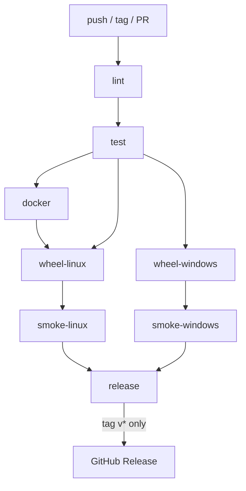

# MLC-LLM DevOps — Build, Test, and Release

Production workflow for local development, automated testing, and cross-platform builds
for the [MLC-LLM](https://github.com/mlc-ai/mlc-llm) codebase. Artifacts are published
to **GitHub Container Registry (GHCR)** and **GitHub Releases**, with **SBOMs,
signatures, and provenance** for supply-chain integrity.

---

## Table of contents

1. [Prerequisites](#1-prerequisites)
2. [Repository layout](#2-repository-layout)
3. [Docker image](#3-docker-image)
4. [Building locally](#4-building-locally)
5. [Running tests](#5-running-tests)
6. [CI/CD pipeline](#6-cicd-pipeline)
7. [Reference](#7-reference)
8. [Testing notes](#8-testing-notes)

---

## 1. Prerequisites

| Tool | Version | Notes |
|------|---------|-------|
| Docker | >= 20.10 | Build and run the multipurpose image |
| Git | any (with LFS) | Clone repo + submodules |
| Python | >= 3.9 (3.13 recommended) | Local runs outside Docker |
| CMake | >= 3.24 | Only needed for native builds (Docker includes it) |
| Rust / Cargo | 1.78.0 | Required by tokenizers-cpp; pinned in CI |
| Vulkan SDK | 1.2.182.0 | Windows CI uses pinned version (Chocolatey); CPU-only builds work without |

---

## 2. Repository layout

```text
.
├── .dockerignore                        # Minimize Docker build context
├── .github/
│   ├── actions/
│   │   └── setup-build-env/
│   │       └── action.yml               # Composite action (DRY: Python, Rust, cache)
│   └── workflows/
│       └── ci.yml                       # CI/CD pipeline
├── docker/
│   ├── Dockerfile                       # Multipurpose image (dev + build)
│   ├── build-entrypoint.sh              # Entrypoint: build | test | shell | *
│   └── config.cmake                     # Non-interactive CMake config (Vulkan + CPU)
├── tests/
│   └── test_infra.py                    # Infrastructure tests (gate CI)
├── docs/
│   └── README.md                        # This file
└── README.md                            # Project overview
```

---

## 3. Docker image

A **single image** serves multiple roles:

| Mode | Command | What happens |
|------|---------|--------------|
| **Dev** (interactive) | `docker run -it -v $(pwd):/workspace mlc-llm-dev` | Drops into bash with all build tools |
| **Build** (non-interactive) | `docker run -v $(pwd):/workspace mlc-llm-dev build` | Compiles MLC-LLM and produces a wheel in `dist/` |
| **Test** | `docker run -v $(pwd):/workspace mlc-llm-dev test` | Runs the upstream MLC-LLM unit test suite |

### 3.1 How the Dockerfile is structured

The image is based on **`python:3.13-slim-bookworm`** — the official Python image
with the exact version we need. System build tools are installed on top:

```text
python:3.13-slim-bookworm (base)
  ├── System packages: build-essential, cmake, git, ninja, gosu, sudo, dev tools
  ├── Vulkan compile toolchain: libvulkan-dev, spirv-tools, spirv-headers, glslang-tools
  ├── Non-root user 'mlc' (UID 1000) with passwordless sudo
  ├── Rust: RUSTUP_HOME=/opt/rust/rustup (read-only), CARGO_HOME=/home/mlc/.cargo (writable)
  ├── pip build tooling: pytest, setuptools, wheel
  └── Entrypoint + baked-in cmake config
```

Key design decisions:

- **Non-root user** (`mlc`, UID 1000) runs all builds and dev shells by default.
  Passwordless `sudo` is available for the rare cases that need root (e.g. `apt-get`).
  The Rust toolchain binaries live in `/opt/rust` (read-only, shared); `CARGO_HOME`
  points to `/home/mlc/.cargo` so Cargo can write its crate registry cache.
- **Official Python base image** instead of Ubuntu + third-party PPA. Reliable,
  maintained, and gives us exact Python version control via the `PYTHON_VERSION` build-arg.
- **Pinned Rust toolchain** via `RUST_TOOLCHAIN` build-arg to keep native builds
  deterministic across CI and Docker.
- **OCI labels** for image metadata (title, source, license).
- **ccache** (Linux) and **sccache** (Windows) for incremental compilation in CI;
  ccache configured via env vars for faster rebuilds during **local dev sessions**
  (persisted via the host-mounted `/workspace/.ccache`).
- **`.dockerignore`** ensures only `docker/` is sent as build context.

### 3.2 How the entrypoint works

`docker/build-entrypoint.sh` dispatches on the first argument (or `MLC_BUILD_MODE` env var):

```text
┌──────────────────────┐
│  First arg / env var │
└──────────┬───────────┘
           │
     ┌─────┼──────┬───────┐
     ▼     ▼      ▼       ▼
  "build" "test" "shell"  *
     │     │      │       │
     ▼     ▼      ▼       ▼
  cmake   pytest  bash    exec "$@"
  + make
  + pip wheel
```

In **build** mode, the entrypoint follows the
[official build-from-source guide](https://llm.mlc.ai/docs/install/mlc_llm.html#option-2-build-from-source):

1. Places `config.cmake` in the `build/` directory. This is the non-interactive
   equivalent of running `python cmake/gen_cmake_config.py` (which requires
   interactive prompts). `CMakeLists.txt` checks `CMAKE_BINARY_DIR` first for
   `config.cmake`, so placing it in `build/` works correctly.
2. Runs `cmake .. && make -j $(nproc)` inside `build/` to compile the native
   libraries (`libmlc_llm.so`, `libtvm_runtime.so`).
3. Packages the `python/` subdirectory as a wheel via `pip wheel . --no-deps`
   (the official guide uses `pip install -e .`; we produce a wheel for CI
   distribution instead).
4. Validates that the native libraries and wheel were produced.

### 3.3 Building the image locally

```bash
docker build -f docker/Dockerfile -t mlc-llm-dev .

# Optional: pin toolchain versions
# docker build -f docker/Dockerfile -t mlc-llm-dev \
#   --build-arg PYTHON_VERSION=3.13 \
#   --build-arg RUST_TOOLCHAIN=1.78.0 .
```

### 3.4 Running a dev shell

```bash
git clone --recursive https://github.com/mlc-ai/mlc-llm.git
cd mlc-llm
docker run -it --rm -v "$(pwd):/workspace" mlc-llm-dev
# Inside the container — follow the official build steps manually:
mkdir -p build && cd build
cmake .. && make -j $(nproc) && cd ..
cd python && pip install -e . && cd ..
```

### 3.5 One-shot wheel build

```bash
docker run --rm -v "$(pwd):/workspace" mlc-llm-dev build
ls dist/*.whl
```

---

## 4. Building locally

### 4.1 Clone

```bash
git clone --recursive https://github.com/mlc-ai/mlc-llm.git
cd mlc-llm
```

### 4.2 With Docker (recommended)

```bash
# Build image
docker build -f docker/Dockerfile -t mlc-llm-dev .

# Produce wheel
docker run --rm -v "$(pwd):/workspace" mlc-llm-dev build

# Install and verify
pip install dist/mlc_llm-*.whl
python -c "import mlc_llm; print(mlc_llm)"
```

### 4.3 Without Docker (native)

Follows the [official build-from-source guide](https://llm.mlc.ai/docs/install/mlc_llm.html#option-2-build-from-source):

```bash
# Step 1: Install deps (Ubuntu/Debian example)
sudo apt-get install build-essential cmake git libvulkan1 libvulkan-dev \
    spirv-tools spirv-headers glslang-tools
curl --proto '=https' --tlsv1.2 -sSf https://sh.rustup.rs | sh

# Step 2: Configure and build
# (The official guide runs `python cmake/gen_cmake_config.py` interactively;
#  we use the pre-generated config.cmake instead.)
mkdir -p build && cd build
cp ../docker/config.cmake config.cmake
cmake .. -DCMAKE_BUILD_TYPE=Release
make -j $(nproc)
cd ..

# Step 3: Install
cd python && pip install -e . && cd ..

# Step 4: Validate
ls -l build/libmlc_llm.so build/libtvm_runtime.so
python -c "import mlc_llm; print(mlc_llm)"
```

---

## 5. Running tests

### 5.1 Infrastructure tests (CI gate)

```bash
pytest tests/test_infra.py -v
```

These validate that the Dockerfile, entrypoint, cmake config, and CI workflow
are structurally correct. They require **no GPU, no native build, and no MLC-LLM
runtime**. These are what run in the CI `test` gate job.

### 5.2 Upstream MLC-LLM unit tests (inside Docker)

The upstream tests import `mlc_llm`, which requires the compiled native libraries.
Run them inside Docker after a build:

```bash
docker run --rm -v "$(pwd):/workspace" mlc-llm-dev test
```

Or manually after building:

```bash
pytest tests/python -m unittest -v -k "not engine and not endpoint"
```

---

## 6. CI/CD pipeline

### 6.1 Workflow file

`.github/workflows/ci.yml` — single file, eight jobs.

### 6.2 Triggers

| Event | Condition | What runs |
|-------|-----------|-----------|
| `push` | branch `main` | lint -> test -> docker -> wheel-* -> smoke-* |
| `push` | tag `v*` | Same + **release** (GitHub Release with wheels, SBOMs, signatures) |
| `pull_request` | to `main` | lint -> test -> docker (no push) -> wheel-* -> smoke-* |
| `workflow_dispatch` | manual | Same as push to main |

A **concurrency group** (`ci-${{ github.ref }}`) cancels in-progress runs when a
new commit is pushed to the same branch, avoiding wasted CI minutes.

### 6.3 Job dependency graph



```text
 lint --> test --+--> docker --> wheel-linux --> smoke-linux --+
                 |                                            +--> release (tag v* only)
                 +--> wheel-windows --> smoke-windows --------+
```

### 6.4 Job details

#### lint

| | |
|---|---|
| **Runs on** | `ubuntu-latest` |
| **Purpose** | Static analysis before any real work starts |
| **Tools** | [hadolint](https://github.com/hadolint/hadolint) (Dockerfile), [actionlint](https://github.com/rhysd/actionlint) via [reviewdog](https://github.com/reviewdog/action-actionlint) (workflow YAML) |

#### test

| | |
|---|---|
| **Runs on** | `ubuntu-latest` |
| **Needs** | `lint` |
| **Purpose** | Run infrastructure tests (`tests/test_infra.py`); **hard gate** for all downstream jobs |
| **Uses** | `.github/actions/setup-build-env` composite action |

Runs `pytest tests/test_infra.py` which validates the Dockerfile, entrypoint,
cmake config, and workflow structure. If any test fails, **no wheels are built
and no image is pushed**.

Full upstream unit tests are available via the Docker `test` entrypoint for
manual execution. CI focuses on **smoke tests** of the built wheels to keep the
pipeline fast and deterministic.

#### docker

| | |
|---|---|
| **Runs on** | `ubuntu-latest` |
| **Needs** | `test` |
| **Purpose** | Build the multipurpose image and push to GHCR |
| **Tags** | `sha-<commit>`, `main` (branch), `v1.2.3` (semver), `latest` (default branch) |
| **Push policy** | Pushes on `push` events only; PRs build but do not push |

Uses `docker/metadata-action` for automatic, standards-compliant tagging. On
non-PR events it also **signs the image (cosign)**, **generates an SBOM**, and
**attests build provenance**.

#### wheel-linux

| | |
|---|---|
| **Runs on** | `ubuntu-latest` |
| **Needs** | `test`, `docker` |
| **Purpose** | Produce Linux x64 `.whl` |
| **Method** | Pulls the sha-tagged Docker image from GHCR; falls back to local build on PRs |

Depends on `docker` to ensure the image is available (no race condition).
Uses the **`sha-<commit>`** tag (always generated) rather than `:latest`
(which is only set on the default branch).
Generates an SBOM and attests provenance for the wheel.

#### wheel-windows

| | |
|---|---|
| **Runs on** | `windows-latest` |
| **Needs** | `test` |
| **Purpose** | Produce Windows x64 `.whl` |
| **Method** | Uses the composite action for setup; runs `cmake + cmake --build` following the official guide (auto-detects Visual Studio generator and x64 platform), then `pip wheel` to package |

Uses **sccache** for incremental compilation, generates an SBOM, and attests
provenance for the wheel.

#### smoke-linux

| | |
|---|---|
| **Runs on** | `ubuntu-latest` |
| **Needs** | `wheel-linux` |
| **Purpose** | Install the Linux wheel in a clean env and `import mlc_llm` |

#### smoke-windows

| | |
|---|---|
| **Runs on** | `windows-latest` |
| **Needs** | `wheel-windows` |
| **Purpose** | Install the Windows wheel in a clean env and `import mlc_llm` |

#### release

| | |
|---|---|
| **Runs on** | `ubuntu-latest` |
| **Needs** | `smoke-linux`, `smoke-windows` |
| **Condition** | Only when ref starts with `refs/tags/v` |
| **Purpose** | Download artifacts, sign wheels (cosign), and create GitHub Release |

Release assets include wheels, **cosign signatures/certificates**, and **SBOMs**
(wheel SBOMs + image SBOM).

### 6.5 DRY and reuse

| Technique | Where |
|-----------|-------|
| **Composite action** (`.github/actions/setup-build-env/`) | Shared by `test` and `wheel-windows`: Python, Rust, pip/cargo caching |
| **Single Dockerfile** | Used by `docker` job (push) and `wheel-linux` job (build inside) |
| **Single cmake config** (`docker/config.cmake`) | Used by Docker entrypoint and Windows native build (both copy to repo root) |
| **Single build method** (`cmake + make`, then `pip wheel`) | Same in entrypoint, Linux CI, and Windows CI — follows [official guide](https://llm.mlc.ai/docs/install/mlc_llm.html#option-2-build-from-source) |
| **Shared env vars** (`REGISTRY`, `IMAGE_NAME`, `PYTHON_VERSION`, `RUST_TOOLCHAIN`, `VULKAN_SDK_VERSION`, `SCCACHE_VERSION`) | Defined once at workflow level |

### 6.6 Caching

| Cache | Scope | Key strategy |
|-------|-------|--------------|
| **Docker layers** | `docker` job | `type=gha` (GitHub Actions cache backend) |
| **pip** | `test`, `wheel-windows` | OS + Python version + `pyproject.toml` hash |
| **Cargo** | `test`, `wheel-windows` | OS + `Cargo.lock` / `Cargo.toml` hash |
| **ccache/sccache** | `wheel-linux`, `wheel-windows` | `.ccache` directory; cmake file hashes (optional S3 via `SCCACHE_*`) |

If `SCCACHE_BUCKET`/`SCCACHE_REGION` are set, sccache will use S3 as a remote
backend; otherwise it falls back to the cached local `.ccache` directory.
These are expected to be configured as **repository secrets**.
When using S3, standard AWS credentials must also be provided as secrets.

### 6.7 Supply-chain security

- **Cosign keyless signing** for container images and wheel artifacts.
- **SBOMs** generated for the Docker image and for each wheel.
- **Build provenance attestations** for image and wheels (OIDC-based).

---

## 7. Reference

### 7.1 Environment variables

| Variable | Used by | Purpose |
|----------|---------|---------|
| `MLC_BUILD_MODE` | Entrypoint | Override mode without positional arg (`build`, `test`, `shell`) |
| `PYTHON_VERSION` | Dockerfile build-arg, CI env | Pin Python version across the stack |
| `RUST_TOOLCHAIN` | CI, Dockerfile | Pin Rust toolchain version |
| `VULKAN_SDK_VERSION` | `wheel-windows` | Pin Vulkan SDK version |
| `SCCACHE_VERSION` | `wheel-windows` | Pin sccache version |
| `CCACHE_DIR` | Docker image, `wheel-linux` | ccache storage for incremental rebuilds |
| `SCCACHE_DIR` | `wheel-windows` | sccache storage directory |
| `SCCACHE_BUCKET` | `wheel-windows` | Optional S3 bucket for remote sccache |
| `SCCACHE_REGION` | `wheel-windows` | Optional S3 region for remote sccache |
| `SCCACHE_S3_KEY_PREFIX` | `wheel-windows` | Optional S3 prefix for cache keys |
| `AWS_ACCESS_KEY_ID` | `wheel-windows` | Optional AWS credential for sccache S3 |
| `AWS_SECRET_ACCESS_KEY` | `wheel-windows` | Optional AWS credential for sccache S3 |
| `GITHUB_TOKEN` | CI | Authentication for GHCR and GitHub Releases |

### 7.2 Links

- [MLC-LLM repository](https://github.com/mlc-ai/mlc-llm)
- [Build from source (official guide)](https://llm.mlc.ai/docs/install/mlc_llm.html#option-2-build-from-source)
- [hadolint](https://github.com/hadolint/hadolint)

---

## 8. Testing notes

This section documents the results of local end-to-end testing, bugs discovered
and fixed during that process, and how the pipeline behaves on GitHub Actions
runners versus a local machine.

### 8.1 Local test execution results

Testing was performed on macOS (Apple Silicon) with Docker Desktop.

| Phase | What ran | Result |
|-------|----------|--------|
| **1. Offline** | `pytest tests/test_infra.py -v` (16 tests) | All passed |
| **1. Offline** | `bash -n docker/build-entrypoint.sh` | Syntax OK |
| **1. Offline** | YAML parse of `ci.yml` + `action.yml` | Both valid |
| **2. Docker** | `docker build -f docker/Dockerfile -t mlc-llm-dev .` | Image built |
| **2. Docker** | `docker run --rm mlc-llm-dev whoami` | `mlc` (non-root) |
| **2. Docker** | `docker run --rm mlc-llm-dev python3 --version` | `Python 3.13.12` |
| **2. Docker** | `docker run --rm mlc-llm-dev build` (no source) | Correctly rejected |
| **2. Docker** | `docker run --rm mlc-llm-dev rustc --version` | `rustc 1.78.0` |
| **2. Docker** | `docker run --rm mlc-llm-dev sudo whoami` | `root` (sudo works) |
| **3. Wheel** | Full build inside Docker with MLC-LLM source (`cmake + make + pip wheel`) | `mlc_llm-0.20.0.dev0-py3-none-linux_aarch64.whl` (60 MB) |

### 8.2 Bugs found and fixed during testing

Two bugs were discovered during actual execution that static analysis (pytest,
linting) could not catch. Both have been fixed.

#### Bug 1: SPIR-V / Vulkan compile-time dependencies missing

- **Symptom:** CMake failed with `_libspirv-NOTFOUND` when configuring TVM
  with `USE_VULKAN ON`.
- **Root cause:** The Dockerfile installed `libvulkan1` and `libvulkan-dev`
  (Vulkan runtime and headers), but TVM's CMake also requires the SPIR-V
  compiler toolchain to compile Vulkan shader code at build time.
- **Fix:** Added `spirv-tools`, `spirv-headers`, and `glslang-tools` to the
  Dockerfile's `apt-get install`.
- **Important:** This is a **compile-time** dependency only. No GPU hardware
  is needed to build MLC-LLM with Vulkan support. The Vulkan runtime is only
  required at **inference time** on the end user's machine. CI runners and
  Docker containers compile Vulkan support into the wheel without a GPU.

#### Bug 2: Cargo write permissions for non-root user

- **Symptom:** `Permission denied (os error 13)` when Cargo tried to write
  to `/opt/rust/cargo/registry/` during the tokenizers-cpp build.
- **Root cause:** `CARGO_HOME` was set to `/opt/rust/cargo`, a shared
  read-only location. The Rust toolchain binaries (`rustc`, `cargo`) are
  read-only and that is fine. But Cargo also needs to **write** its crate
  registry cache and download directory when fetching dependencies.
- **Fix:** Split the two concerns:
  - `RUSTUP_HOME=/opt/rust/rustup` -- read-only toolchain binaries.
  - `CARGO_HOME=/home/mlc/.cargo` -- writable per-user crate cache.
  - `PATH` still includes `/opt/rust/cargo/bin` so the binaries are found.

### 8.3 GitHub Actions runners vs local vs self-hosted

#### Architecture difference

Our local test ran on **macOS Apple Silicon** (ARM64). Docker Desktop runs
Linux ARM containers, so the wheel was tagged `linux_aarch64`. On GitHub
Actions `ubuntu-latest`, the runners are **x86_64**, so the wheel will be
tagged `linux_x86_64` -- which is the target platform required by the
assessment.

#### GitHub-hosted runners (used by this pipeline)

| Aspect | `ubuntu-latest` | `windows-latest` |
|--------|-----------------|-------------------|
| **Arch** | x86_64 | x86_64 |
| **Docker** | Pre-installed | Not available |
| **GPU** | None | None |
| **RAM** | 7 GB (free) / 16 GB (large) | 7 GB |
| **Disk** | ~30 GB free | ~30 GB free |
| **Build time** | ~10-30 min (C++ compile) | ~10-30 min |
| **Timeout** | 6 hours (default) | 6 hours (default) |

Key points:

- **No GPU needed.** The pipeline **compiles** Vulkan support into the wheel
  using the SPIR-V toolchain (pure software). It does not run inference. No
  GPU hardware is required at build time.
- **Docker on Linux only.** The `wheel-linux` job uses our Docker image. The
  `wheel-windows` job builds natively because Docker is not available on
  Windows runners.
- **Submodule clone time.** MLC-LLM with submodules is ~1 GB. On GitHub's
  network this takes 1-3 minutes (vs ~30 minutes on a residential connection).

#### When self-hosted runners would be needed

| Scenario | Why self-hosted |
|----------|-----------------|
| Running inference tests (model execution) | GPU hardware required |
| CUDA wheel builds | NVIDIA GPU + CUDA toolkit needed for testing |
| Build time > 30 min becoming a bottleneck | More cores + persistent ccache |
| Private network dependencies | Runners inside a VPN or private registry |

**For this pipeline, GitHub-hosted runners are sufficient.** The workflow
compiles and packages only -- no GPU, no inference, no private dependencies.

#### Summary: local vs CI

```text
                      Local (macOS ARM)         GitHub Actions (x86_64)
                      ─────────────────         ───────────────────────
Architecture          aarch64                   x86_64
Wheel platform        linux_aarch64             linux_x86_64 / win_amd64
GPU                   Not needed                Not needed
Docker                Docker Desktop            Pre-installed (Linux)
Build method          cmake + make + pip wheel  Same (Linux via Docker) / native (Windows)
Runner type           --                        GitHub-hosted (free tier)
Self-hosted needed?   --                        No
```
